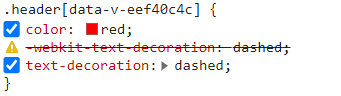

# 样式方案

## 解决的痛点

- 选择器平铺，开发体验差
- 样式污染问题
- 浏览器兼容问题
- 打包后代码体积问题

## 解决方案

- css 预处理器 ：sass/scss 、less 等
- css module
- css 后后处理器 postcss
- css in Js
- CSS 原子化：tailwind css 、 windi css 等

## CSS 预处理器

vite 本身对 css 预处理器做了内置的支持。也就是说，即使你不经过任何的配置，，都可以直接使用 css 预处理

**vite 自动引入全局变量**

```ts
// vite.config.ts
import { normalizePath } from "vite";
// 如果类型报错，需要安装 @types/node: pnpm i @types/node -D
import path from "path";

// 全局 scss 文件的路径
// 用 normalizePath 解决 window 下的路径问题
const variablePath = normalizePath(path.resolve("./src/variable.scss"));

export default defineConfig({
  // css 相关的配置
  css: {
    preprocessorOptions: {
      scss: {
        // additionalData 的内容会在每个 scss 文件的开头自动注入
        additionalData: `@import "${variablePath}";`,
      },
    },
  },
});
```

## css module

CSS Modules 在 Vite 也是一个开箱即用的能力，Vite 会对后缀带有.module 的样式文件自动应用 CSS Modules

```ts
// vite.config.ts
export default {
  css: {
    modules: {
      // 一般我们可以通过 generateScopedName 属性来对生成的类名进行自定义
      // 其中，name 表示当前文件名，local 表示类名
      generateScopedName: "[name]__[local]___[hash:base64:5]",
    },
    preprocessorOptions: {
      // 省略预处理器配置
    },
  },
};
```

## postcss

一般你可以通过 postcss.config.js 来配置 postcss ，不过在 Vite 配置文件中已经提供了 PostCSS 的配置入口，我们可以直接在 Vite 配置文件中进行操作。
例如 ：安装 autoprefixer

```ts
// vite.config.ts 增加如下的配置
import autoprefixer from "autoprefixer";

export default {
  css: {
    // 进行 PostCSS 配置
    postcss: {
      plugins: [
        autoprefixer({
          // 指定目标浏览器
          overrideBrowserslist: ["> 1%", "last 2 versions"],
        }),
      ],
    },
  },
};
```



postcss 常用插件：

- postcss-pxtorem
- postcss-preset-env
- autoprefixer
- cssnano ：主要用来压缩 CSS 代码，跟常规的代码压缩工具不一样，它能做得更加智能，比如提取一些公共样式进行复用、缩短一些常见的属性值等等。

[更多 postcss 插件](www.postcss.parts/)

## CSS in JS 不常用

## css 原子化

CSS 原子化框架主要包括 Tailwind CSS 和 Windi CSS
Windi CSS 作为前者的替换方案，实现了按需生成 CSS 类名的功能，开发环境下的 CSS 产物体积大大减少，速度上比 Tailwind CSS v2 快 20~100 倍！
当然，Tailwind CSS 在 v3 版本也引入 JIT(即时编译) 的功能，解决了开发环境下 CSS 产物体积庞大的问题。

### windi CSS 接入

**参考官网**

安装 windicss 及对应的 vite 插件
`pnpm i windicss vite-plugin-windicss -D`

除了本身的原子化 CSS 能力，Windi CSS 还有一些非常好用的高级功能，在此我给大家推荐自己常用的两个能力: attributify 和 shortcuts。
要开启这两个功能，我们需要在项目根目录新建 windi.config.ts，配置如下:

```ts
//windi.config.ts
import { defineConfig } from "vite-plugin-windicss";

export default defineConfig({
  attributify: true,
  shortcuts: {
    "flex-c": "flex justify-center items-center",
  },
});
```
