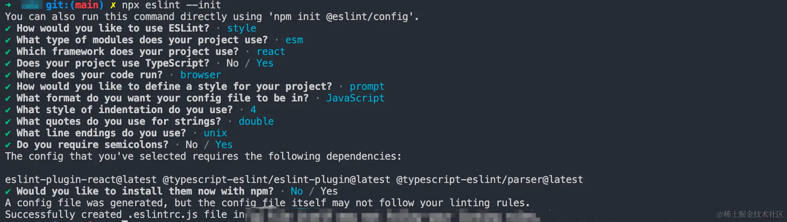

# 代码规范

- 提高代码质量
- 提前规避语法错误

## JS/TS 规范工具：ESLint

eslint 是在 ecmascript/JavaScript 代码中识别和报告模式匹配的工具，他的目的是保证代码的一致性和避免错误

### 初始化

```bash
pnpm i eslint -D
```

执行初始化命令，并进行如下的命令交互

```ts
npx eslint --init
```



### .eslintrc.js 配置文件解读

#### parser-解析器

eslint 底层默认使用 Espree 进行 AST 解析，单解析器目前已经基于 Acron 来实现，虽然能够解析绝大多数 ECMAScript 规范的语法，但是还不支持 TypeScript，因此需要引入其他的解析器来完成 TS 的解析

社区提供`@typescript-eslint/parser`这个方案，，专门为了 TypeScript 解析而诞生的，将 TS 代码转换为 Espree 能够识别的格式，然后进行格式检查

#### parserOptions - 解析器选项

这个配置是对解析器进行能力定时，默认情况下 Eslint 支持 ES5 语法，你可以配置这个选项，具体内容如下：

- ecmaVersion：ES +数字 / ES + 年份
- sourceType ：默认为 script 如果使用 es module 设置为 module
- ecmaFeatures ：是一个对象，如果想使用额外的语言特性，如开启 jsx

#### rules - 具体代码规则

rules 配置即代表在 ESLint 中手动调整哪些代码规则，比如禁止在 if 语句中使用赋值语句这条规则可以像如下的方式配置:

```ts
// .eslintrc.js
module.exports = {
	// 其它配置省略
	rules: {
		// key 为规则名，value 配置内容
		'no-cond-assign': ['error', 'always']
	}
};
```

在 rules 对象中，key 一般为规则名，value 为具体的配置内容，在上述的例子中我们设置为一个数组，数组第一项为规则的 ID，第二项为规则的配置。

- off 或 0，表示关闭规则
- on 或 1，表示开启规则，不过违背规则后只抛出 warning，而不会导致程序退出。
- error 或 2：表示开启规则，不过违背规则后抛出 error，程序会退出。
  也能直接将 rules 对象的 value 配置成 ID，如: "no-cond-assign": "error"。

#### Plugin

上面提到过 ESLint 的 parser 基于 Acorn 实现，不能直接解析 TypeScript，需要我们指定 parser 选项为@typescript-eslint/parser 才能兼容 TS 的解析。同理，ESLint 本身也没有内置 TypeScript 的代码规则，这个时候 ESLint 的插件系统就派上用场了。我们需要通过添加 ESLint 插件来增加一些特定的规则，比如添加@typescript-eslint/eslint-plugin 来拓展一些关于 TS 代码的规则

```ts
// .eslintrc.js
module.exports = {
	// 添加 TS 规则，可省略`eslint-plugin`
	plugins: ['@typescript-eslint']
};
```

值得注意的是，添加插件后只是拓展了 ESLint 本身的规则集，但 ESLint 默认并没有开启这些规则的校验！如果要开启或者调整这些规则，你需要在 rules 中进行配置，如:

```ts
// .eslintrc.js
module.exports = {
	// 开启一些 TS 规则
	rules: {
		'@typescript-eslint/ban-ts-comment': 'error',
		'@typescript-eslint/no-explicit-any': 'warn'
	}
};
```

#### extends -继承配置

extends 相当于继承零一分 eslint 配置，可以设置为 iyge 字符串，也可以配置成一个字符串数组。主要分为如下 3 中情况

1. 从 eslint 本身继承
2. 从类似 eslint-config-xxx 的 npm 包继承
3. 从 eslint 插件继承

```ts
// .eslintrc.js
module.exports = {
   "extends": [
     // 第1种情况
     "eslint:recommended",
     // 第2种情况，一般配置的时候可以省略 `eslint-config`
     "standard"
     // 第3种情况，可以省略包名中的 `eslint-plugin`
     // 格式一般为: `plugin:${pluginName}/${configName}`
     "plugin:react/recommended"
     "plugin:@typescript-eslint/recommended",
   ]
}
```

有了 extends 的配置，对于之前所说的 ESLint 插件中的繁多配置，我们就不需要手动一一开启了，通过 extends 字段即可自动开启插件中的推荐规则:

```ts
extends:["plugin:@typescript-eslint/recommend"]
```

#### env 和 globals

这两个配置分别表示运行环境和全局变量，在指定的运行环境中会预设一些全局变量，比如:

```
// .eslint.js
module.export = {
  "env": {
    "browser": "true",
    "node": "true"
  }
}
```

指定上述的 env 配置后便会启用浏览器和 Node.js 环境，这两个环境中的一些全局变量(如 window、global 等)会同时启用。

有些全局变量是业务代码引入的第三方库所声明，这里就需要在 globals 配置中声明全局变量了。每个全局变量的配置值有 3 种情况:

- "writable"或者 true，表示变量可重写；
- "readonly"或者 false，表示变量不可重写；
- "off"，表示禁用该全局变量。

```ts
// .eslintrc.js
module.exports = {
	globals: {
		// 不可重写
		$: false,
		jQuery: false
	}
};
```

## 与Prettier强强联合

虽然 ESLint 本身具备自动格式化代码的功能(eslint --fix)，但术业有专攻，ESLint 的主要优势在于代码的风格检查并给出提示，而在代码格式化这一块 Prettier 做的更加专业，因此我们经常将 ESLint 结合 Prettier 一起使用。

**ESLint检测、prettier代码格式化**

`pnpm i prettier -D`

```js
.prettierrc.js
// .prettierrc.js
module.exports = {
  printWidth: 80, //一行的字符数，如果超过会进行换行，默认为80
  tabWidth: 2, // 一个 tab 代表几个空格数，默认为 2 个
  useTabs: false, //是否使用 tab 进行缩进，默认为false，表示用空格进行缩减
  singleQuote: true, // 字符串是否使用单引号，默认为 false，使用双引号
  semi: true, // 行尾是否使用分号，默认为true
  trailingComma: "none", // 是否使用尾逗号
  bracketSpacing: true // 对象大括号直接是否有空格，默认为 true，效果：{ a: 1 }
};
```

其中eslint-config-prettier用来覆盖 ESLint 本身的规则配置，而eslint-plugin-prettier则是用于让 Prettier 来接管eslint --fix即修复代码的能力。

## Husky + lint-staged 的git提交工作流集成

### 提交前的代码lint检查

在上文中我们提到了安装 ESLint、Prettier的VScode插件或者Vite插件，在开发阶段提前规避掉代码格式的问题，但实际上这也只是将问题提前暴露，并不能保证规范问题能完美解决，还是可能导致线上的代码出现不规范的情况。那么如何避免这类问题？

我们可以在提交代码的时候进行卡点检查，也就是拦截git commit命令，进行代码格式检查，只要确保通过格式检查参能允许正常提交，社区通过husky来完成这件事情
`pnpm i husky -D`
值得提醒的是，有很多人推荐在package.json中配置 husky 的钩子:

```json
package.json
 {
  "husky":{
    "pre-commit":'pnpm run lint'
  }
 }
```

这种做法在 Husky 4.x 及以下版本没问题，而在最新版本(7.x 版本)中是无效的！在新版 Husky 版本中，我们需要做如下的事情:

#### 1、初始化 husky

初始化："npx husky install"
并将 husky install作为启动前的脚本

```json
// package.json
{
	"script": {
		// 会在安装npm以来后自动执行
		"prepare": "husky install"
	}
}
```

添加husky钩子，`npx husky add .husky/pre-commit "pnpm run lint"`
接着你将会在项目根目录的.husky目录中看到名为pre-commit的文件，里面包含了 git commit前要执行的脚本现在，当你执行 git commit 的时候，会首先执行 npm run lint脚本，通过 Lint 检查后才会正式提交代码记录。
不过，刚才我们直接在 Husky 的钩子中执行 npm run lint，这会产生一个额外的问题: Husky 中每次执行npm run lint都对仓库中的代码进行全量检查，也就是说，即使某些文件并没有改动，也会走一次 Lint 检查，当项目代码越来越多的时候，提交的过程会越来越慢，影响开发体验。
`pnpm i -D lint-staged`

> 在package.json中添加配置，这里会报错
> 建议新建 lint-staged.config.cjs

```json
// lint-staged.config.cjs
{
	"lint-staged": {
		"**/*.{js,jsx,tsx,ts}": ["pnpm run lint", "git add ."]
	}
}
```

接下来我们需要在 Husky 中应用lint-stage，回到.husky/pre-commit脚本中，将原来的npm run lint换成如下脚本:
`pnpm run lint:lint-staged`
如此一来，我们便实现了提交代码时的增量 Lint 检查。

## 提交时的commit信息规范

除了代码规范检查之后，Git 提交信息的规范也是不容忽视的一个环节，规范的 commit 信息能够方便团队协作和问题定位。首先我们来安装一下需要的工具库，执行如下的命令:

```bash
pnpm i commitlint @commitlint/cli @commitlint/config-conventional -D
```

接下来新建.commitlintrc.js：

```ts
// .commitlintrc.js
module.exports = {
	extends: ['@commitlint/config-conventional']
};
```

一般我们直接使用@commitlint/config-conventional规范集就可以了，它所规定的 commit 信息一般由两个部分: type 和 subject 组成，结构如下:

```
// type 指提交的类型
// subject 指提交的摘要信息
<type>: <subject>
```

常用的type值包括如下：

- feat：新增新功能
- fix：修复bug
- chore：一些不影响功能的修改
- docs：文档的修改
- pref：性能方面的优化
- refactor：代码重构
- test：添加一些测试代码等等。

接下来我们将commitlint的功能集成到 Husky 的钩子当中，在终端执行如下命令即可:

```ts
npx husky add .husky/commit-msg "npx --no-install commitlint -e $HUSKY_GIT_PARAMS"
```

你可以发现在.husky目录下多出了commit-msg脚本文件，表示commitlint命令已经成功接入到 husky 的钩子当中。现在我们可以尝试对代码进行提交，假如输入一个错误的 commit 信息，commitlint 会自动抛出错误并退出
